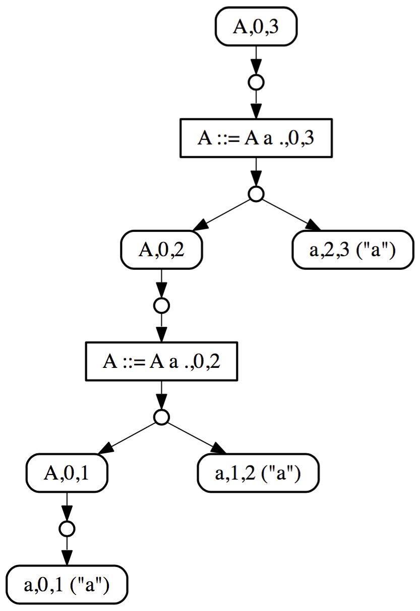
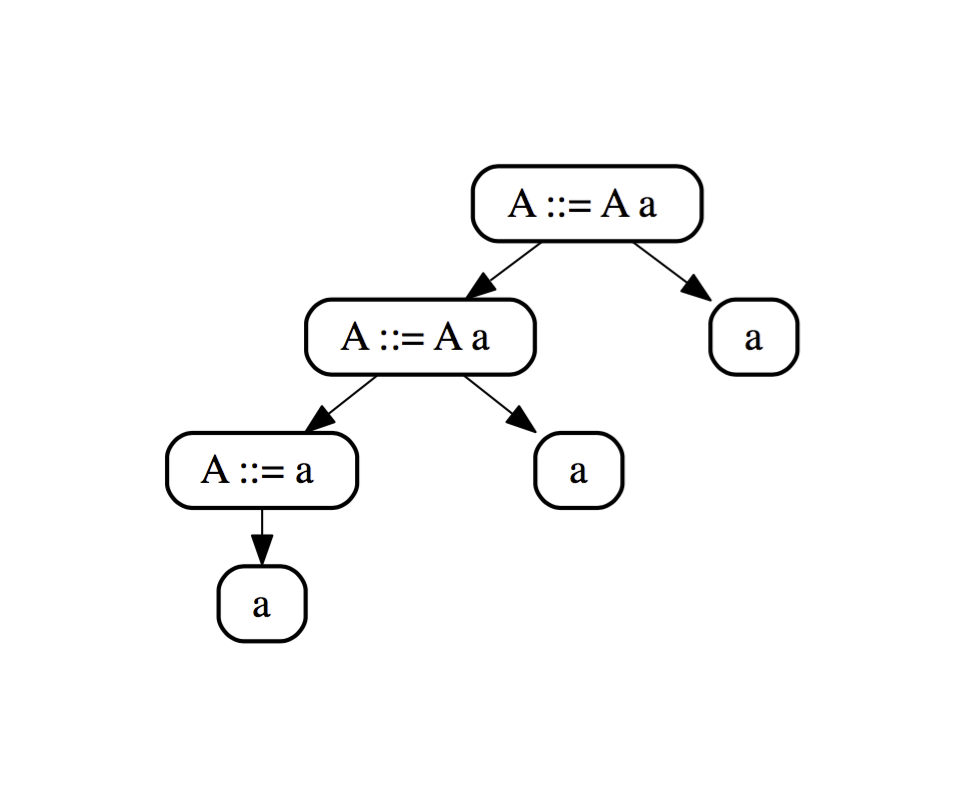

## Running Iguana

Iguana is a grammar interpreter, as opposed to a parser generator. This means
that Iguana directly interprets an in-memory representation of a grammar, and 
there is no need to first generate a parser from the grammar specification.
For example, consider the following simple grammar that encodes a list of a's:

    A ::= A 'a' 
        | 'a'

You can simply save the above grammar in a text file and load it, or create
it via the Iguana grammar API:



Nonterminal A = Nonterminal.withName("A");                // nonterminal A
Terminal a = Terminal.from(Character.from('a'));          // terminal 'a'
Rule r1 = Rule.withHead(A).addSymbols(A, a).build();      // rule A ::= A 'a'
Rule r2 = Rule.withHead(A).addSymbols(a).build();         // rule A ::= 'a'
Grammar grammar = Grammar.builder().addRule(r1).build();  // the resulting grammar



The following Java code shows how to parse an input string using this
grammar:



// Creating an input from the string 'aaa'
Input input = Input.fromString("aaa");

// Parsing the input from the nonterminal A
ParseResult result = Iguana.parse(input, grammar, A);



Iguana is build on top of the <a href="{{ site.baseurl }}/documentation.html#gll_parsing">Generalized LL (GLL)</a> parsing algorithm. GLL is a 
top-down parsing algorithm that supports all context-free grammars and produces
a <a href="{{ site.baseurl }}/documentation.html#binarized_sppf">binarized SPPF</a>.
Binarized SPPFs, however, are part of the internal machinery of GLL, and are not 
meant for the end user. Iguana provides support for conversion of binarized SPPF 
terms that reflect the context-free grammar used for parsing. We can access
the SPPF and parse tree from a <code>ParseResult</code> as follows.



if (result.isParseSuccess()) {
    NonterminalNode sppfNode = result.asParseSuccess().getSPPFNode();
    Tree tree = result.asParseSuccess().getTree();
} else {
   System.out.println(result.asParseFailure());
}



Iguana provides [utilities]() for visualizing SPPF and trees. For example, 
the SPPF and terms corresponding to the example above are shown below.

	

		
	

	

		
	

