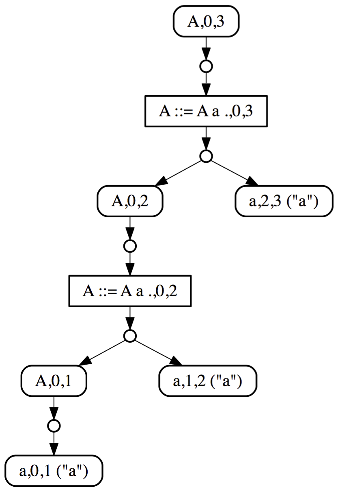
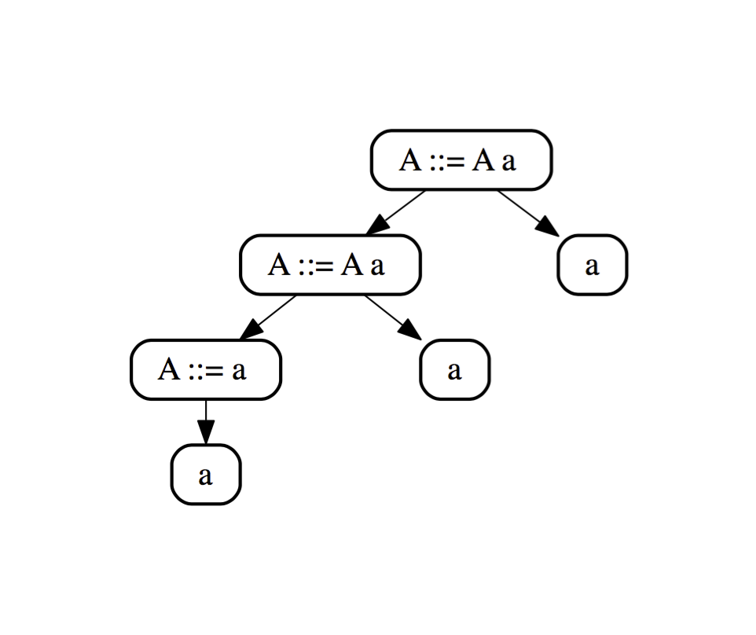

## Running Iguana

Iguana is a grammar interpreter, as opposed to a parser generator. This means
that Iguana directly interprets an in-memory representation of a grammar, and 
there is no need to first generate code from the grammar specification.
For example, consider the following simple grammar written 
in <a href="http://localhost:4000/documentation.html#Syntax">Iguana syntax</a> 
that encodes a list of a's:

<pre><code class="language-bison">
A ::= A 'a' 
   |  'a'		
</code></pre>

You can simply save the above grammar in a text file, e.g., <code>Simple.iggy</code> 
and load it with Iguana:

<pre><code class="language-scala">
val grammar = IggyParser.getGrammar(Input.fromPath("src/resources/grammars/Simple.iggy"))
</code></pre>

To parse an input string using this grammar you need to do the following:

<pre><code class="language-scala">
val input = Input.fromString("aaa")
val start = Nonterminal.withName("A")
val result = Iguana.parse(input, grammar, start)</code></pre>

Iguana is build on top of <a href="https://cdn.rawgit.com/iguana-parser/papers/master/cc15.pdf">our version</a> of 
<a href="http://www.sciencedirect.com/science/article/pii/S0167642312000627">the Generalized LL</a> (GLL) parsing algorithm. GLL is a 
top-down parsing algorithm that supports all context-free grammars and produces
a binarized SPPF. Binarized SPPFs, however, are part of the internal machinery of GLL, and are not 
meant for the end user. Iguana provides support for conversion of binarized SPPF 
to terms that correspond to our grammar model. We can, for example, visualize
the SPPF and parse tree from a <code>ParseResult</code> as follows.

<pre><code class="language-scala">
result match {
  case s:ParseSuccess => SPPFVisualization.generate(s.sppfNode, "graphs", "simple_sppf")
                         TermVisualization.generate(s.getTree, "graphs", "simple_terms")
  case e:ParseError   => println(e)
}</code></pre>

The SPPF and terms corresponding to the example above are shown below. More information
about terms can be found <a href="http://localhost:4000/documentation.html#ParseTrees">here</a>.

	

		
	

	

		
	

