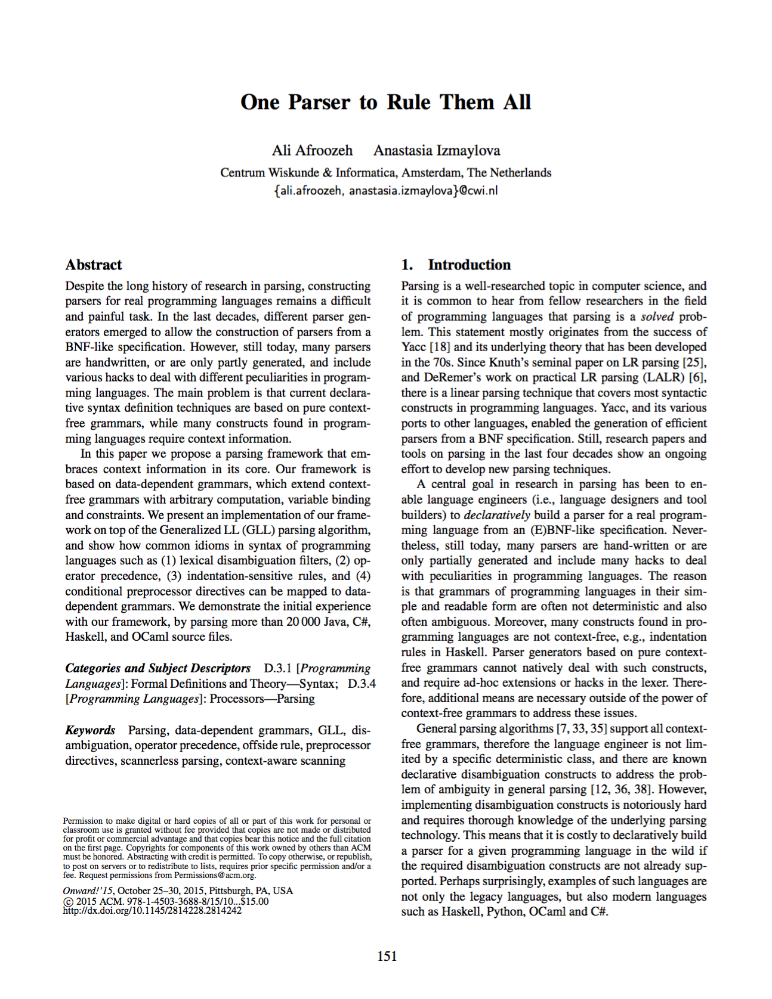

# Iguana: A data-dependent parsing framework

Iguana is a parsing framework based on <a href="{{ site.baseurl }}/documentation.html#data_dependent_grammars">data-dependent grammars</a>.
Data-dependent grammars extend context free grammars with arbitrary computation, 
variable binding, and constraints. These powerful features enable construction of
parsers for context-sensitive languages. We also use data-dependent grammars
as a layer to implement different disambiguation constructs such as 
<a href="">operator precedence</a>.

Iguana is created by <a href="http://afroozeh.github.io" target="_blank">Ali Afroozeh</a>
and <a href="http://anastassija.github.io" target="_blank">Anastasia Izmaylova</a> at <a href="http://www.cwi.nl">CWI</a> 
Amsterdam. For source code and bug reports please visit 
our <a href="https://github.com/iguana-parser">Github</a> repository.

	

		
	

	

		
	

    

