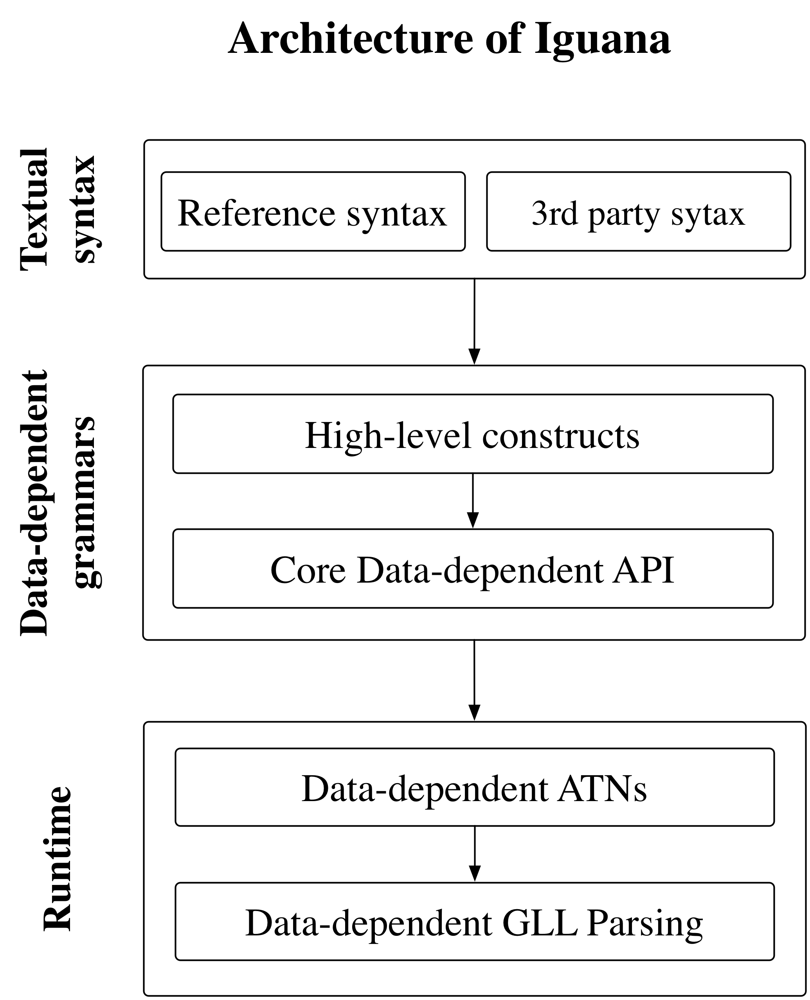
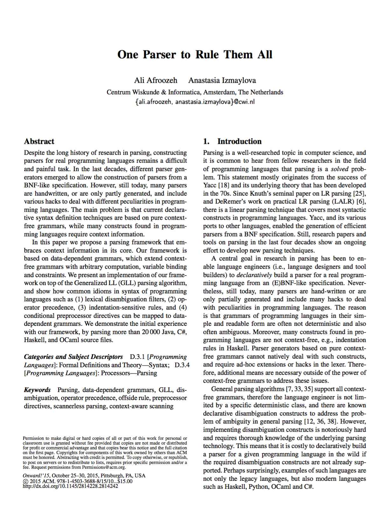
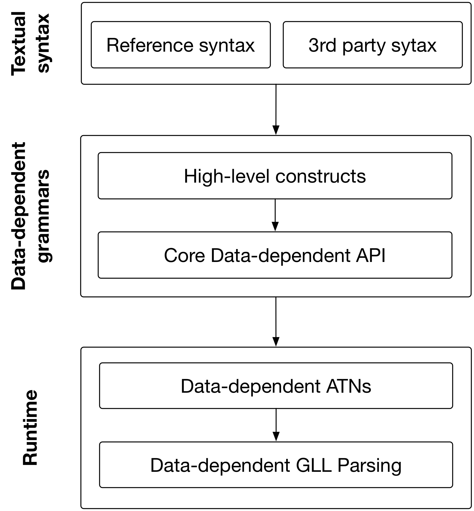

    

# Iguana: A data-dependent parsing framework

Iguana is a parsing framework based on <a href="{{ site.baseurl }}/documentation.html#data_dependent_grammars">data-dependent grammars</a>.
Data-dependent grammars extend context free grammars with arbitrary computation, 
variable binding, and constraints. These powerful features enable construction of
parsers for context-sensitive languages. We also use data-dependent grammars
as a layer to implement different disambiguation constructs such as 
<a href="http://localhost:4000/examples.html#OperatorePrecedence">operator precedence</a>.

Iguana is created by <a href="http://afroozeh.github.io" target="_blank">Ali Afroozeh</a>
and <a href="http://anastassija.github.io" target="_blank">Anastasia Izmaylova</a> at <a href="http://www.cwi.nl">CWI</a> 
Amsterdam. For source code and bug reports please visit 
our <a href="https://github.com/iguana-parser">Github</a> repository.

<!-- 

	

		
	

	

		
	

 -->

	

		<h4>Selected publications:</h4>
		<ul style="padding-left:20px; padding-top:5px;">
			<li><a href="https://cdn.rawgit.com/iguana-parser/papers/master/onward15.pdf">One Parser to Rule Them All</a></li>
			<li><a href="https://cdn.rawgit.com/iguana-parser/papers/master/cc15.pdf">Faster, Practical GLL Parsing</a></li>
			<li><a href="https://cdn.rawgit.com/iguana-parser/papers/master/pepm16.pdf">Operator Precedence for Data-Dependent Grammars</a></li>
		</ul>		
	
	
	

		<h4>Architecture of Iguana:</h4>
		
	

